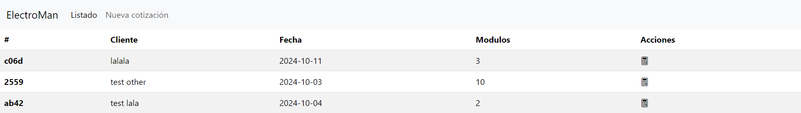
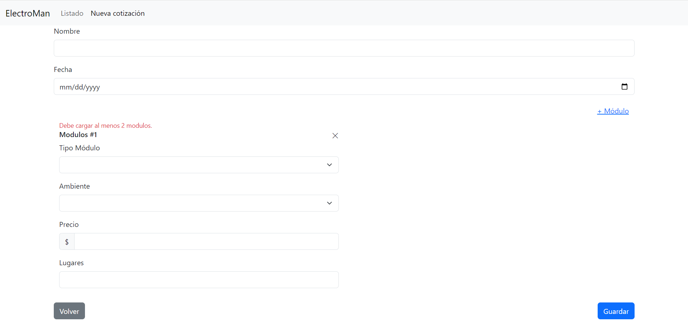
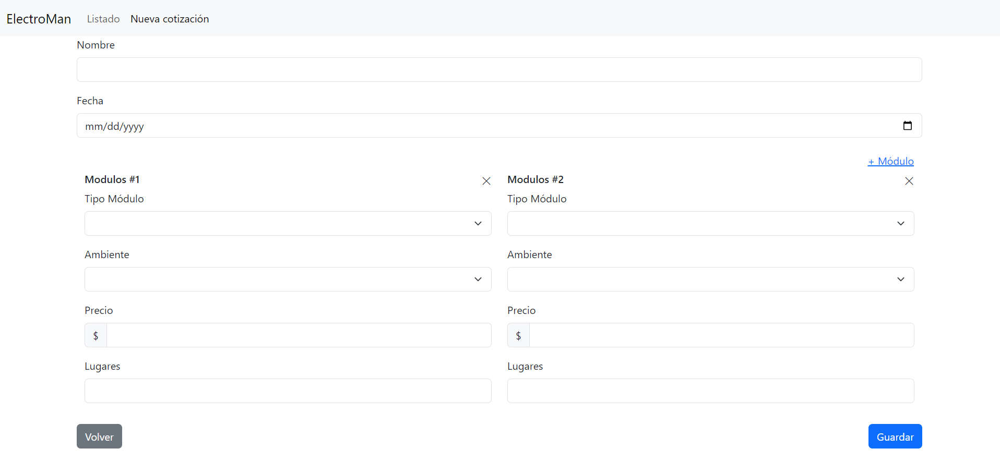
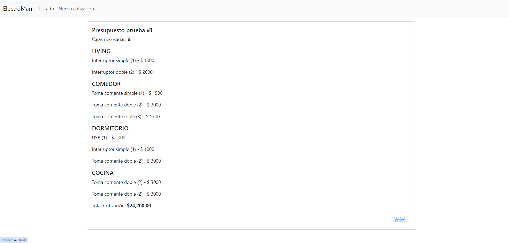

## Requerimientos del Sistema de Cotización de Instalación Eléctrica

### Descripción
Se solicita un sistema para la **cotización de una instalación eléctrica** en una propiedad. El sistema permitirá realizar una cotización que detalle los insumos necesarios para realizar la instalación y el costo del trabajo. 

Por medio de la utilización de la libreria json-server se debe levantar un servidor local que permita la escritura y lectura en un archivo tipo `json`. Para más información visite el siguiente enlace [JSON Server](https://www.npmjs.com/package/json-server).

En el archivo `db.json` se provee un listado de los tipos de módulos con caracteristicas como los espacios que ocupan en una caja (receptaculo que almacena los distintos módulos: interruptores, toma corrientes, usb, etc), el precio y otros. Es importante aclarar que cada caja tiene 3 lugares disponibles, pero cada modulo puede ocupar 1 o más lugares (3 como máximo).

### Funcionalidad
El técnico podrá crear una cotización que incluya los distintos tipos de módulos que necesita para cada espacio (ambiente). La misma debe ser guardada en caso de que necesite ser consultada nuevamente.

### Formulario de Cotización
API: `/api/budgets` (POST)
El formulario debe contener los siguientes campos:

- **Fecha de la cotización**: Requerida, no puede ser mayor al día actual.
- **Cliente**: Requerido, solo se podrá cargar un presupuesto por cliente.
- **Listado de módulos**: 
  - Selección de tipo de modulo (obtenido de la lista proporcionada). API: `/api/module-types` (GET)
  - Precio (solo lectura)
  - Lugares que ocupa (solo lectura)
  - Ambiente (requerido): un select con datos en base a el enumerador `Zone`
  - Se deben cargar al menos **5 módulos**.

### Consideraciones importantes
- Cada caja tiene **3 lugares** como máximo.
  - Puede albergar hasta **3 módulos** de `1 slot`.
  - O bien, **1 módulo** de `2 slots` y **1 módulo** de `1 slot`, lo cual da `3 slots`.
- La cantidad de slots está definida en base al `module-type` de la api `api/module-types`.

### Cálculo del Presupuesto
API: `/api/budgets/{{id}}` (GET)
Al guardar el presupuesto, se debe calcular y mostrar el resumen con:

1. **Cantidad de cajas necesarias** calculada en base a los módulos cargados (tener en cuenta que pueden quedar espacios sin ocupar los cuales permaneceran de esa manera).
2. **Módulos agrupados** por ambiente (mostrar cada módulo con su nombre, precio y slots).
3. **Total de la cotización** calculado en base a el precio que tiene cada módulo.

### Visualización de Presupuestos
- Los presupuestos guardados se visualizarán en una tabla con un botón para poder ver el presupuesto en modo solo lectura.

### MockUp Images

### Consideraciones Técnicas
- Utilizar **Formularios Reactivos**, aplicando las validaciones indicadas tanto para los controles fijos como los generados dinamicamente.
- Utilizar **FormArray** para la generación de los módulos.
- Utilizar **Routing** y **LazyLoading**.
- Los datos deberán almacenarse en una **API** para poder recuperarlos posteriormente.
